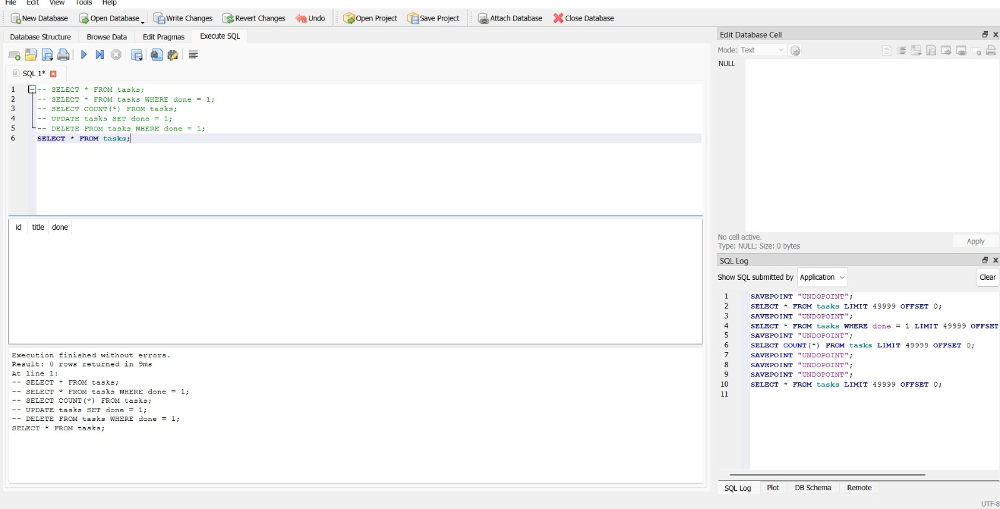
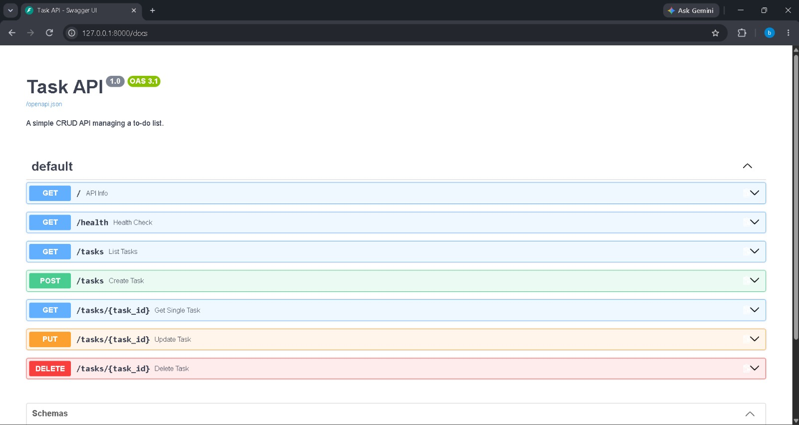

# Task API (Week 3 - A2 Connecting to the Database)

A CRUD API for managing a to-do list, built with Python, FastAPI, and SQLite.
The API keeps the same endpoints and response shapes as the in-memory version,
but tasks now persist across server restarts.

## Why SQLite?

SQLite is lightweight, serverless, and stores the database in one local file.
It requires no separate database server or setup, making it a good fit for this
assignment while still providing real SQL persistence.

## Database

The database file is `tasks.db` in the project root. On startup, the application:

1. Creates the `tasks` table if it does not exist.
2. Inserts three example tasks only when the table is empty.

The database file is ignored by Git so each clone creates its own local
database automatically.

## Install and run

Create and activate a virtual environment:

```bash
python -m venv venv
```

Windows PowerShell:

```powershell
.\venv\Scripts\Activate.ps1
```

macOS/Linux:

```bash
source venv/bin/activate
```

Install dependencies and start the server:

```bash
pip install -r requirements.min.txt
uvicorn main:app --reload --port 8000
```

The interactive API documentation is available at
[http://localhost:8000/docs](http://localhost:8000/docs).

## Endpoints

| Operation    | Method   | Endpoint      | Description             |
|--------------|----------|---------------|-------------------------|
| API info     | `GET`    | `/`           | Returns API information |
| Health check | `GET`    | `/health`     | Returns service health  |
| List         | `GET`    | `/tasks`      | Returns all tasks       |
| Read         | `GET`    | `/tasks/{id}` | Returns one task        |
| Create       | `POST`   | `/tasks`      | Creates a task          |
| Update       | `PUT`    | `/tasks/{id}` | Updates a task          |
| Delete       | `DELETE` | `/tasks/{id}` | Deletes a task          |

Unknown task IDs return `404` with an error object. Missing or empty titles
return `400`.

## Example request

Windows PowerShell:

```powershell
curl.exe -i -X POST http://localhost:8000/tasks `
  -H "Content-Type: application/json" `
  -d "@test_data/task_post_body.json"
```

macOS/Linux:

```bash
curl -i -X POST http://localhost:8000/tasks \
  -H "Content-Type: application/json" \
  -d "@test_data/task_post_body.json"
```

## SQL explored in Stage 4

The database was opened in DB Browser for SQLite and the following queries
were executed:

```sql
SELECT *
FROM tasks;
SELECT *
FROM tasks
WHERE done = 1;
SELECT COUNT(*)
FROM tasks;
UPDATE tasks
SET done = 1;
DELETE
FROM tasks
WHERE done = 1;
```

Screenshot from the database viewer:



## Swagger UI


