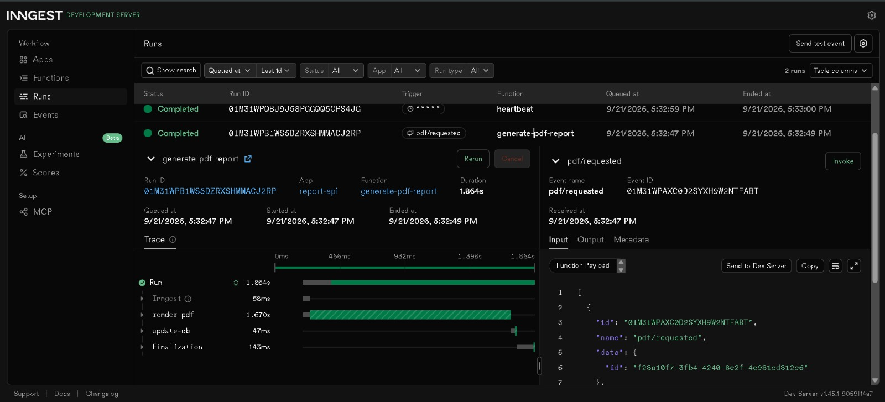
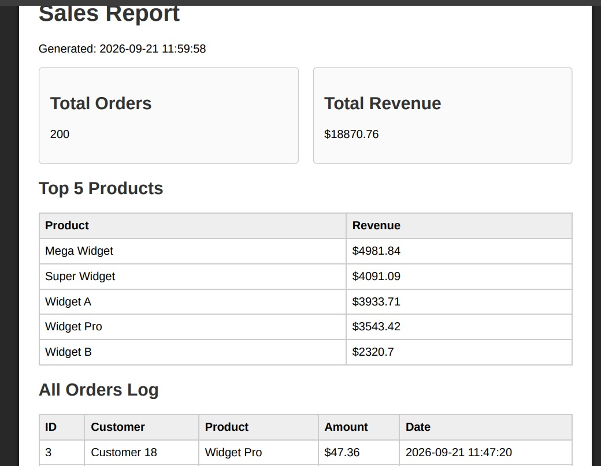

# Task API & Background Reporting Service

A FastAPI CRUD API for a to-do list, now running with PostgreSQL in Docker.
The public API remains the same as A2; only the storage implementation changed
from SQLite to a PostgreSQL repository.

The project now includes a narrow AI workflow: `POST /triage` classifies one
support message into a fixed, validated JSON result. The existing PostgreSQL,
Docker, and Supabase authentication features remain available. It also includes a robust background jobs pipeline using
Inngest and Playwright to generate PDF reports.

## Stack

- FastAPI
- PostgreSQL 16
- Docker Compose
- Psycopg 3
- Supabase Auth
- Gemini through its OpenAI-compatible API
- Inngest Python SDK for durable background jobs
- Playwright (Headless Chromium) for PDF rendering
- SQLite (Dedicated dataset for PDF report generation)

## Configuration

Copy the example environment file:

```powershell
Copy-Item .env.example .env
```

`.env` is ignored by Git. It contains the local PostgreSQL credentials and
connection string, plus the Supabase project URL and anon key. `.env.example`
is committed so another developer knows which variables are required.

Create a Supabase project, then copy the values from **Project Settings ->
API** into `.env`:

```env
SUPABASE_URL=https://your-project-ref.supabase.co
SUPABASE_KEY=your-supabase-anon-key
```

The application creates the Supabase client during startup and fails with a
clear configuration error if either value is missing. Never commit `.env` or
real Supabase keys.

The LLM provider is configured with three environment variables:

```env
LLM_BASE_URL=https://generativelanguage.googleapis.com/v1beta/openai/
LLM_API_KEY=your-gemini-api-key
LLM_MODEL=gemini-3.6-flash
```

Changing those three values is enough to use another OpenAI-compatible
provider. `LLM_ENABLED=false` disables model calls and returns a deterministic
low-confidence `other` result.

## Run the complete stack

Install Docker Desktop, then run:

```powershell
docker compose up --build -d
```

Seed the PDF reporting database (`report.db`) with 200 required shop orders:

```powershell
docker compose exec app python -m app.seed
```

The API is available at [http://localhost:8000](http://localhost:8000), and
Swagger UI is available at [http://localhost:8000/docs](http://localhost:8000/docs).

Start the local Inngest Dev Server in a second terminal:

```powershell
npx inngest-cli@latest dev -u http://localhost:8000/api/inngest
```

Its dashboard is available at [http://localhost:8288](http://localhost:8288).
Local development requires no account, secret, or paid service.

The `db` service uses the named `postgres_data` volume. The `app` service waits
for PostgreSQL to become healthy before starting. `app/schema.sql` creates the
`tasks` table and inserts the three example tasks only when the table is empty.

Stop the stack without deleting data:

```powershell
docker compose down
```

To intentionally delete the persisted database volume:

```powershell
docker compose down -v
```

## A3 architecture

The route handlers in `app/main.py` keep the same endpoint paths, request
validation, response shapes, and status codes as A2. They call the
`PostgresTaskRepository` in `app/repository.py` instead of executing database
queries themselves. This is the storage swap required by the assignment:
the service/API behavior stays stable while the repository changes.

## Application layout

Runtime Python modules live under `app/`, with the LLM package in
`app/llm/`, its versioned prompt assets in `app/prompts/`, and the PostgreSQL
initialization schema in `app/schema.sql`. Start the API with the
`app.main:app` Uvicorn module path. The `evals/` directory is evaluation
tooling rather than application runtime code.

Documentation is organized under `docs/`: assignment history and job-card
materials are in [`docs/assignments/`](docs/assignments/), and interface and
database evidence is in [`docs/screenshots/`](docs/screenshots/). These
folders contain documentation only; they are not imported by the application.

## Endpoints

| Operation         | Method         | Endpoint                 | Description                                      |
|-------------------|----------------|--------------------------|--------------------------------------------------|
| API info          | `GET`          | `/`                      | Returns API information                          |
| Health check      | `GET`          | `/health`                | Returns service health                           |
| List              | `GET`          | `/tasks`                 | Returns all tasks                                |
| Read              | `GET`          | `/tasks/{id}`            | Returns one task                                 |
| Create            | `POST`         | `/tasks`                 | Creates a task                                   |
| Update            | `PUT`          | `/tasks/{id}`            | Updates a task                                   |
| Delete            | `DELETE`       | `/tasks/{id}`            | Deletes a task                                   |
| Sign up           | `POST`         | `/auth/signup`           | Creates a Supabase user                          |
| Log in            | `POST`         | `/auth/login`            | Returns access and refresh tokens                |
| Log out           | `POST`         | `/auth/logout`           | Protected; signs out the current session         |
| Public info       | `GET`          | `/public/info`           | Public, no token required                        |
| Profile           | `GET`          | `/protected/profile`     | Protected; verifies the bearer token             |
| Dashboard         | `GET`          | `/protected/dashboard`   | Protected; verifies the bearer token             |
| Triage            | `POST`         | `/triage`                | Classifies a support message with validated JSON |
| Start report      | `POST`         | `/reports`               | Validates a topic and queues a background report |
| Report status     | `GET`          | `/reports/{id}`          | Returns pending, done, or failed report state    |
| Start PDF report  | `POST`         | `/pdf-reports`           | Queues generation of the sales PDF               |
| PDF status        | `GET`          | `/pdf-reports/{id}`      | Returns PDF background queue status              |
| Download PDF      | `GET`          | `/pdf-reports/{id}/file` | Returns the actual PDF file generated            |
| Inngest functions | `GET/POST/PUT` | `/api/inngest`           | Inngest Dev Server integration                   |

Unknown IDs return `404` with `{"error": "Task {id} not found"}`. Missing or
empty titles return `400`.

Protected endpoints require:

```text
Authorization: Bearer <access_token>
```

Missing or malformed tokens return `401` with
`{"error": "Access token required"}`. Invalid or expired tokens return `401`
with `{"error": "Invalid or expired token"}`.

## Auth flow

Sign up:

```powershell
curl.exe -i -X POST http://localhost:8000/auth/signup `
  -H "Content-Type: application/json" `
  -d '{"email":"test@example.com","password":"password123"}'
```

Log in and copy the returned `access_token`:

```powershell
curl.exe -i -X POST http://localhost:8000/auth/login `
  -H "Content-Type: application/json" `
  -d '{"email":"test@example.com","password":"password123"}'
```

Use the token with the protected profile route:

```powershell
curl.exe -i http://localhost:8000/protected/profile `
  -H "Authorization: Bearer <access_token>"
```

Swagger UI at `/docs` includes the **Authorize** button and bearer security
metadata for `/protected/profile`, `/protected/dashboard`, and
`/auth/logout`.

## AI triage

`POST /triage` accepts:

```json
{
  "text": "The dashboard crashes every time I click Save."
}
```

and returns:

```json
{
  "category": "bug",
  "urgency": "high",
  "confidence": 0.94,
  "reason": "The customer reports a repeatable dashboard failure."
}
```

Run it with:

```powershell
curl.exe -i -X POST http://localhost:8000/triage `
  -H "Content-Type: application/json" `
  -d '{"text":"The dashboard crashes every time I click Save."}'
```

Invalid input is rejected with `400` before a model call. Model output is
parsed and validated against `app/llm/schema.py`; malformed output gets exactly one
repair attempt, then returns `422` and is written to
`logs/quarantine.jsonl`. Model calls use a 30-second timeout, no SDK retries,
and application retries only timeouts, `429`, and `5xx` responses with
bounded exponential backoff.

Each model response writes prompt version, model, token counts, duration, and
repair status to `logs/cost.jsonl`. The logs are ignored by Git.

## BE-06 background reports

`POST /reports` accepts `{"topic":"cats"}` and returns `202 Accepted` with an
ID and `pending` status without doing slow work. `GET /reports/{id}` first
returns `pending`, then `done` with a result, or `failed` with an error.
Unknown IDs return `404`; missing or blank topics return `400` before an event
is sent.

| Function              | Trigger            | Behavior                                     |
|-----------------------|--------------------|----------------------------------------------|
| `say-hello`           | `test/hello`       | Five-second durable sleep and greeting       |
| `make-report`         | `report/requested` | Eight-second sleep, build step, retries=2    |
| `heartbeat`           | `* * * * *`        | Logs pending/done/failed counts every minute |
| `generate-pdf-report` | `pdf/requested`    | Queries DB and renders HTML -> PDF           |

`make-report` is limited to two concurrent runs. Its database update only
transitions `pending` to `done`, so duplicate events cannot build the same
report twice. This idempotency guard matters because delivery and worker
retries can legitimately run a job more than once. A topic of `fail` raises
`The report oven is broken!`, marks the report failed, and lets Inngest show
the initial attempt plus two retries. Retries are for work failures; invalid
input is rejected at the API boundary and is never retried.

### BE-06 Submission Deliverables

**202 Response & Polling Proof:**

```text
(.venv) PS> curl -i -X POST http://localhost:8000/reports -H "Content-Type: application/json" -d '{"topic":"cats"}'
HTTP/1.1 202 Accepted
{"id":"f28a10f7-3fb4-4240-8c2f-4e981cd812c6", "status":"pending"}

(.venv) PS> curl -i http://localhost:8000/reports/f28a10f7-3fb4-4240-8c2f-4e981cd812c6
HTTP/1.1 200 OK
{"id":"f28a10f7...","topic":"cats","status":"pending"}

# Roughly 8-10 seconds later...
(.venv) PS> curl -i http://localhost:8000/reports/f28a10f7-3fb4-4240-8c2f-4e981cd812c6
HTTP/1.1 200 OK
{"id":"f28a10f7...","topic":"cats","status":"done","result":"Report for cats: background work completed."}
```

* **Stage 3 (Validation vs. Retry):** Missing input gets a `400 Bad Request` and is rejected at the door because bad
  data will never magically succeed on a retry. Background job retries are strictly reserved for temporary execution
  failures (e.g., network drops or database timeouts).
* **Stage 4 (Cron Expressions):**
    * Running every day at 08:00: `0 8 * * *`
    * Running every Sunday at 22:00: `0 22 * * 0`

**Inngest Dashboard Screenshot:**


**Bonus Stage 6: AI vs. Me:**

* **Prompt used:** "Write a FastAPI app with Inngest to create a background job that sleeps for 8 seconds and returns a
  report status. Include polling endpoints."
* **What the AI did better:** It wrote out the Pydantic schemas for the requests much faster than writing them by hand.
* **What it got wrong:** It missed the "accept fast" concept initially and tried to execute the `await inngest.send()`
  *after* doing some mock validation sleeps, which defeats the purpose.
* **What my prompt forgot:** I forgot to specify that the report states (`pending`, `done`) must be persisted to a
  database (SQLite/Postgres), so the AI just used a global in-memory Python dictionary which wipes on server restart.

## BE-08 PDF Report Generator

This project supports an HTML-to-PDF reporting pipeline utilizing **Playwright Headless Chromium**. The generation
logic (`query` -> `render` -> `store`) natively incorporates the BE-06 background job stretch pattern. Generating a
large HTML table inside a web request hangs the server; moving this slow work completely out of the request solves
performance latency for clients waiting to do other actions.

### BE-08 Submission Deliverables

**Dataset Chosen:**

* **Option A — The Little Shop:** 200 randomly seeded orders with products, customer names, random amounts, and dates
  within the last 30 days stored in `report.db` (SQLite).

**Pasted SQL Queries:**

```sql
-- Total Orders
SELECT COUNT(*)
FROM orders;

-- Total Revenue
SELECT SUM(amount)
FROM orders;

-- Top 5 Products by Revenue
SELECT product, SUM(amount) as rev
FROM orders
GROUP BY product
ORDER BY rev DESC LIMIT 5;

-- Orders per day (Last 7 Days)
SELECT date (created_at) as d, COUNT (*) as c
FROM orders
WHERE date (created_at) >= date ('now', '-7 days')
GROUP BY d
ORDER BY d;
```

**Generate & Download Proof:**

```bash
curl -i -X POST http://localhost:8000/pdf-reports
```

Then

```bash
curl -i -o my-report.pdf http://localhost:8000/pdf-reports/{id}/file
```

* **Stage 4 (Threshold for Background Jobs):** Report generation should be moved out of the synchronous HTTP request and
  into a background job the moment the generation takes longer than ~1–2 seconds, preventing the server from keeping the
  client hostage and avoiding browser timeouts.
* **Stage 5 (Idempotency):** The once-per-day check protects against a user double-clicking the "Generate" button, which
  would otherwise spin up multiple expensive headless browser instances and duplicate the 20MB file. In the real world,
  a missing idempotency check on a checkout page could result in charging a customer's credit card twice for the same
  single order.

**PDF Report Screenshot:**


**Bonus Stage 7: AI vs. Me:**

* **Prompt used:** "Write a FastAPI app with Playwright to generate a PDF report from a SQLite DB for store sales,
  including page break protections."
* **What the AI did better:** It instantly outputted nicely styled CSS classes for the Flexbox layout, making the
  summary boxes look great out of the box.
* **What it got wrong:** It returned the raw PDF bytes in the POST request rather than persisting it to disk and
  returning an artifact link. It entirely skipped the critical "store and link" lesson.
* **What my prompt forgot:** I forgot to explicitly instruct it about repeating table headers (`<thead>`), resulting in
  the AI writing a standard `<table>` that would slice a data row exactly in half between page 1 and page 2.

## Evaluation

The eight labelled cases are in `evals/cases.json`. Run the live evaluation
after configuring Gemini:

```powershell
.\.venv\Scripts\python.exe evals\run.py
```

The result must be recorded here with the date and prompt version after the
run.

**Evaluation result (2026-09-17, prompt `triage-v1`):** `6/8` category
matches (`75%`). The final two cases were blocked by Gemini's free-tier
per-minute quota after five requests, so this is a quota-limited result rather
than a claim that all eight model judgements were successful. The two failed
requests were recorded by the runner as provider `429` errors.

## Persistence proof

1. Start the stack with `docker compose up --build`.
2. Create a task through Swagger UI or with:

   ```powershell
   curl.exe -i -X POST http://localhost:8000/tasks `
     -H "Content-Type: application/json" `
     -d '{"title":"Survives restart"}'
   ```

3. Stop only the application:

   ```powershell
   docker compose stop app
   ```

4. Restart the application and confirm the task remains:

   ```powershell
   docker compose start app
   curl.exe http://localhost:8000/tasks
   ```

5. Restart both containers without removing the volume:

   ```powershell
   docker compose down
   docker compose up --build
   curl.exe http://localhost:8000/tasks
   ```

The task remains because PostgreSQL data is stored in the `postgres_data`
Docker volume. Do not use `docker compose down -v` during this persistence
test because that deliberately removes the database.

## BE-07 AI assignment stage summary

- Stage 0: provider configuration and stub mode
- Stage 1: triage endpoint, input validation, and output schema
- Stage 2: versioned prompt asset and endpoint wiring
- Stage 3: parsing, validation, one repair attempt, and quarantine
- Stage 4: timeout, retry policy, cost logging, and kill switch
- Stage 5: evaluation set, results, and publication

## W4 stage summary

- Stage 0: Supabase client and environment configuration
- Stage 1: signup and login routes
- Stage 2: public route and bearer-header protection
- Stage 3: Supabase token verification
- Stage 4: reusable auth dependency and logout
- Stage 5: Swagger bearer authorization
- Stage 6: this README and GitHub publication

## A2 SQLite assignment history

The original A2 implementation used SQLite and exposed the same public CRUD
routes. The A3 repository preserves that API contract while replacing the
storage layer with PostgreSQL. The complete historical stage record is
maintained in [`docs/assignments/history.md`](docs/assignments/history.md);
these prior assignment stages remain intentionally retained even though A2 is
now historical.

## Documentation assets

- [BE-07 job card](docs/assignments/be-07-job-card.md)
- [Swagger UI screenshot](docs/screenshots/swagger-screenshot.jpeg)
- [Database browser screenshot](docs/screenshots/db-browser-screenshot.jpeg)
- [Inngest Dashboard](docs/screenshots/inngest-dashboard.jpeg)
- [PDF Report](docs/screenshots/pdf-report.jpeg)

The active stack uses PostgreSQL and Docker Compose. The screenshots document
prior and current assignment evidence; they do not describe a second runtime
or database configuration.
